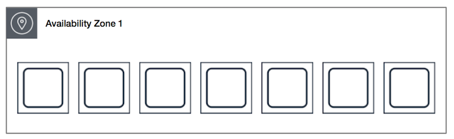
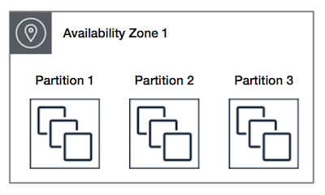

# 📌 AWS SAA 자격증을 위한 중간 정리 - EC2

## 📎 AWS EC2에 대해서...

Amazon Elastic Compute Cloud (이하 EC2)는 프로세스부터 OS까지 사용자가 직접 취사선택하여 생성할 수 있는 클라우드 인스턴스이다. 이후에 나오는 AWS의 다양한 서비스의 근간이 되는 서비스 이며, 서비스의 형태에 맞춰 특화된 다른 서비스와는 다르게 EC2는 어떤 서비스에도 대응할 수 있는, 기본중의 기본이다.

### EC2의 인스턴스 유형
EC2는 다양한 형식의 인스턴스를 지원하며 인스턴스의 첫 알파벳에서 어떤 인스턴스인지 알 수 있다.
- 범용적인, 균형있는 컴퓨팅을 위한  M, T
- 고성능 프로세서를 사용하는 C
- 대규모 데이터 세트를 처리하기 위한 메모리가 최적화 된 R, X - 엘라스틱 캐시
- 스토리지에 최적화 되어있는, OLTP 시스템에 사용하는 I, G, H1 - RDB, NoSQL

### EC2의 사용 플랜
EC2는 사용의 용도에 맞춰서 다양한 요금 플랜을 지원한다.
- 사용한 만큼 내는 온디맨드
- 장기간 계약을 통해서 금액을 할인받는 Savings Plans
- 선결제 예약을 통해서 금액을 할인받는 Reserved Instances
- 그리고 경매와 유사한 시스템인 Spot Instances
- EC2의 하드웨어를 완전히 dedicate 받을 수 있는 Dedicated Hosts

### Elastic IP 탄력적 IP
탄력적 IP는 인스턴스를 인터넷에 노출시킬 수 있는 공용 IP  
**계정당 5개 생성 가능**

>> 결론적으로는 Elastic IP를 직접 인스턴스에 할당하지 말자, 제어도 힘들고 확장도 어렵다

## Placement Groups 배치 그룹
각각의 EC2들이 서로 어떤식으로 배치 될 것인가에 관해서 정의하는 방식이다. 각 그룹에 해당하는 EC2 인스턴스들은 해당하는 그룹 셋팅에 맞게 배치되게 된다.

1. Cluster 클러스터  

  
    클러스터 배치 방식은 Latency가 가장 적은 방식으로 단일 AZ에 EC2들이 배치된다.
    가장 빠르지만 가장 위험한 배치 방식처리  
    사용예시) 빅데이터 처리
2. Spread 분산
  
    spread는 하드웨어에 분산하여 배치하는 것으로 AZ 당 7개의 인스턴스만 가능하다는 제약 사항이 있다.  
    장애에 있어서 가장 안전한 방식이다.  
    사용예시) 장애에 민감한 크리티컬한 어플리케이션
    
3. Partition 분할  
      
    파티션을 기준으로 인스턴스를 나눈다. 파티션은 동일한 랙을 기준으로 하는데, 각 파티션 끼리는 실패로 부터 격리되어 안전하고, 파티션 내부에서는 충분한 속도 확보가 되는 효율적인 방식이다.  
    사용예시) 카산드라, 카프카
    
## ENI Elastic Network Interfaces
ENI는 Elastic IP와 동일하게 EC2가 네트워크에 연결할 수 있도록 해주는 가상 네트워크 카드다.
ENI 는 private IPv4와 public IPv4를 가질 수 있으며, private IPv4 하나당 Elastic IP 하나와, 여러개의 보안그룹, 그리고 MAC 어드레스를 attribute로 가질 수 있다.  
ENI를 교체해서 배포나 업데이트가 가능하고 (다만 Elstic IP를 통해서 처리하는게 가능하다)
또는 MAC Address에 라이센스가 종속된 경우, ENI에 라이센스를 부여하고 EC2 인스턴스를 바꿔가면서 서비스가 가능하다.
  
  
### Elastic IP VS ENI  
두 개의 서비스 모두 IP 네트워크와 관련 되어 있고, Elastic 이라는 명칭이 붙어서 헷갈릴 수 있다.  
다음과 같은 차이점을 보인다.  
  
**Elastic IP**
Elastic IP는, 테이블로 관리되는 public IP에 대하여 고정해주는 서비스이다. 테이블에 다양한 public IP가 존재하며, EC2가 생성되면서 같이 생성되는 ENI의 private IP를 특정 public IP주소와 고정적으로 연결해주는 서비스로, 통상적으로 EC2가 재부팅 되면 새로운 publc IP에 할당되어야 할 IP를 고정적으로 할당해주는 서비스를 뜻한다.  

**ENI**  
ENI는 위와 동일하게 가상의 네트워크 카드로, EC2하나에 여러개의 ENI를 둘 수 있으며, 실질적으로 subnet에 존재하는건 EC2가 아닌 ENI로, EC2에 다양한 ENI를 설치하고, 각 ENI를 public과 private subnet에 각각 위치 시키고, 다른 보안 그룹을 설정하여서 EC2에 다양한 방식으로 접근할 수 있도록 설정 할 수 있다.  

## EC2 Hibernate 절전

EC2를 완전하게 종료하는 Terminate와는 다르게 EC2를 일시적을 절전모드에 넣는 것으로, 메모리에 존재하는 정보를 EBS 볼륨에 저장하고(이 때, EBS는 암호화 되어야 함) EC2를 종료하고, 다시 켜면 EBS에 있는 정보를 그대로 메모리로 호출하게 된다. 메모리의 크기가 150기가 이하여야 하며, EBS에 메모리의 정보를 저장할 충분한 공간이 있어야 한다.