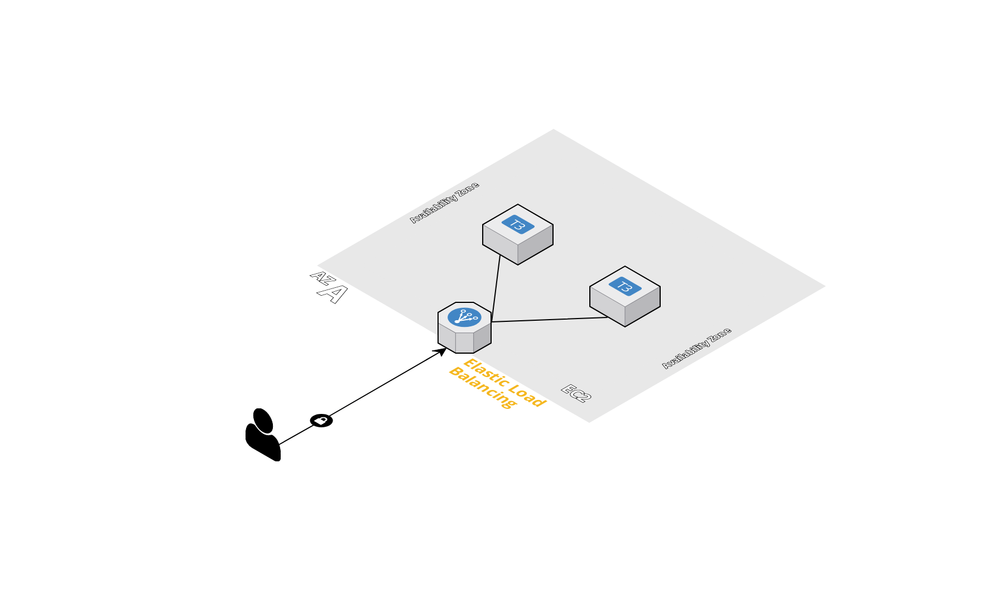
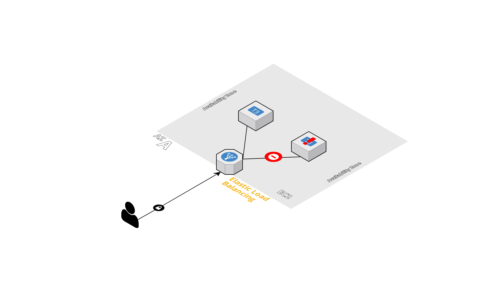
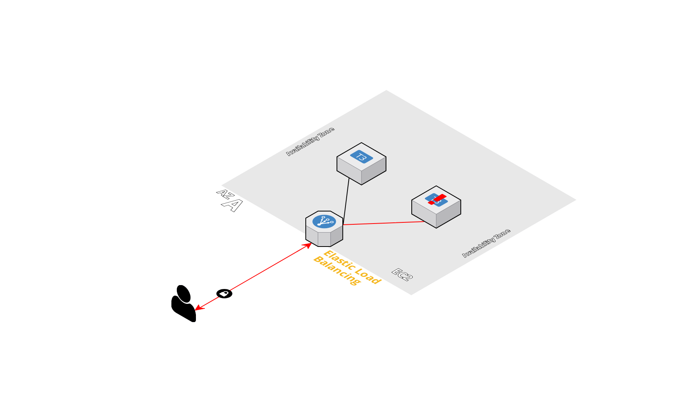
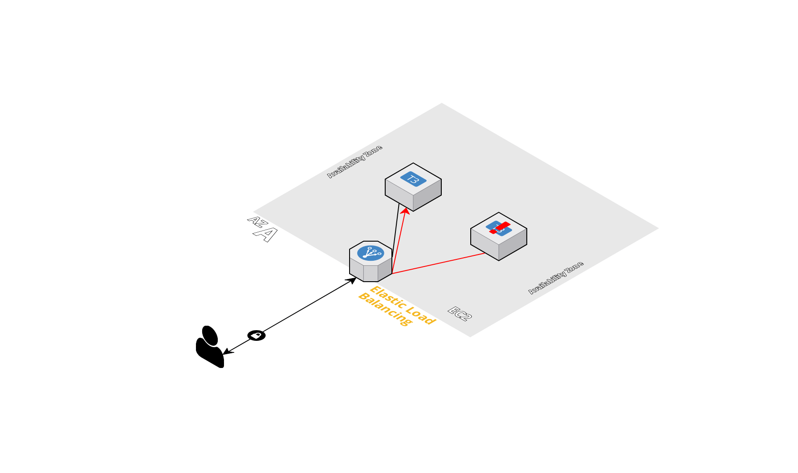

# 📌 아니이거왜같은이름달고서하는짓이달라요?
회사에서는 주로 Oracle Cloud를 통해서 프로젝트를 진행하고 있었고, 회사에 쌓여있는 클라우드에 대한 지식도 오라클에 촛점이 맞춰져 있었다. 사실 클라우드 도입이 오래 된 것이 아니기 때문에, 팀 전체가 새로운 클라우드 프로바이더를 만날 때 마다 공부하는 방식으로 프로젝트를 진행하고 있었다.  
>OCI는 안그러던데...?  

NCloud와 AWS를 쓰면서 상사에게 들었던 말이었다. 당시 상황을 보여주자면  
  
다음과 같이 한 로드밸런서에 두개의 인스턴스가 붙어있는 상태였다. 이 상황에서 만약 한 인스턴스의 WAS가 모종의 이유로 ( 오류나 배포)인해서 내려가게 되는데  
  

7레이어에 해당하는 보통의 ALB들은 `Health Check`를 하기 직전까지 이런 WAS의 이슈를 알지 못한다. 인스턴스 자체는 통신이 잘 되고 있기 때문, 그래서 이런 이슈가 존재하는 상태로 새로고침을 계속하면, 503과 정상페이지가 번갈아 나오는 것을 확인할 수 있다.

  
위와 같이 `Health Check`전까지는 계속해서 이슈 페이지가 뜬다. 이건 네이버 클라우드도 이런식이고, 그래서 배포 할때에도 문제가 존재했다.  
  
정말 신기하게도, OCI는 이렇지 않다. OCI는 어느정도 `failover`도 겸하는 리버스 프록시의 역할도 로드밸런서가 겸한다.  
  
그래서 위의 이미지와 같이 다른 타겟인스턴스로 보내버린다. 그래서 약간의 딜레이가 존재하긴 하지만 정상적인 페이지만 계속해서 보내주게 된다. Nginx와 같은 WAS 레벨의 로드밸런서, 리버스 프록시의 역할도 겸하면서 작동하게 되는 것이다.  
AWS도 Ncloud도 이런식으로 동작 하지 않아서, 조금 혼란이 있었다.

## 🤦 배포상의 이슈
그래서 우리팀이 기존에 사용하던 오라클 클라우드와 다른 ALB의 작동 방식으로 인해서, 배포를 진행 할 경우 배포를 받은 인스턴스에서 503 에러가 그대로 클라이언트 단으로 타고 흘러 나가는 문제가 발생했다. 네이버 클라우드에서 진행중인 프로젝트의 코드를 배포하면 일시적으로 503과 정상페이지가 번갈아 뜨는 것이었다.  

일단 OCI의 의외의 놀라움은 제쳐두고 GO 언어를 통해서 배포시에 ALB Target Group에서 인스턴스를 일시적으로 등록 해제하도록 하는 유틸리티와, 해제했던 인스턴스를 등록하는 유틸리티를 GO언어를 통해서 작성했다.(생각보다 NCloud의 CLI나, GO SDK에 대한 사용성이 API 자체와 너무나도 달랐다...)  

이런저런 이슈들을 뒤로하고 일단 급하게나마 회사 배포 환경에 맞는 유틸리티 작성한다고 좀 고생했다. 바이너리 파일 형태로 리눅스에서 돌릴 수 있도록 하기 위해서 가장 최적화 된 언어가 GO였고, 새로운 언어 적응한다고 챗GPT와 함께 열심히 굴러다녔다.  

ALB가 다 같은 ALB가 아니다 - 오늘의 교훈